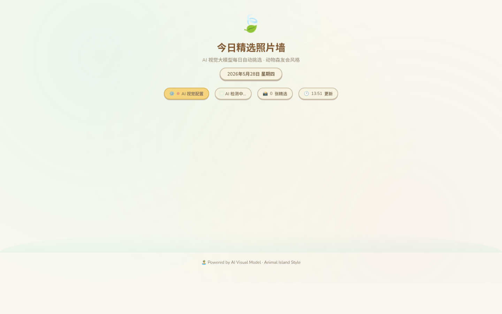

# 🏝️ Animal Island Photo Wall

动物森友会风格的 AI 照片墙，支持视觉大模型自动点评。

## 📸 预览



> 点击「AI 视觉配置」按钮可配置 Vision API，实现 AI 自动点评照片

## ✨ 功能

- 📸 **2×4 网格布局** — 8 张照片精美展示
- 🤖 **AI 视觉点评** — 接入 Vision API 实时分析照片
- ⭐ **AI 评分** — 每张照片自动生成评分
- 🖼️ **全屏预览** — 适配浏览器大小，键盘 ← → 切换
- ⚙️ **可视化配置** — 页面内直接配置 API，无需改代码

## 🚀 快速开始

### 方式一：直接打开

双击 `photo-wall.html` 即可查看（需要配置后才能加载本地照片）

### 方式二：本地服务器（推荐）

```bash
# 使用 Node.js
npx serve .

# 或使用 Python
python -m http.server 8080
```

然后访问 `http://localhost:8080/photo-wall.html`

## ⚙️ 配置视觉大模型

1. 打开页面后，点击顶部黄色的 **「⚙️ AI 视觉配置」** 按钮
2. 填写以下信息：
   - **API 地址**：如 `https://api.openai.com/v1`
   - **API Key**：你的密钥（仅存浏览器本地）
   - **模型名称**：需要支持 Vision 的模型，如 `gpt-4o`、`qwen-vl-plus`
   - **照片文件夹路径**：服务器上照片的绝对路径
3. 点击 **「💾 保存」**，页面自动刷新生效

### 支持的模型

| 提供商 | 模型 |
|--------|------|
| OpenAI | `gpt-4o`, `gpt-4o-mini` |
| 通义千问 | `qwen-vl-plus`, `qwen-vl-max` |
| DeepSeek | `deepseek-chat`（需 VL 版） |
| 本地 | 任何 OpenAI 兼容的视觉模型 |

> 💡 未配置 API 时，会使用模拟点评数据

## 📁 项目结构

```
photo-wall-package/
├── photo-wall.html      # 照片墙页面（主文件）
├── index.html           # Animal Island UI 主页
├── assets/              # CSS、JS、字体等资源
└── README.md            # 本文件
```

## 🔧 照片数据

照片通过 Photo API 服务读取本地文件夹。如需使用：

1. 启动 Photo API 服务（`api/photos.cjs`）
2. 在配置中设置正确的文件夹路径
3. 页面会自动扫描并加载图片

## 📝 License

MIT
